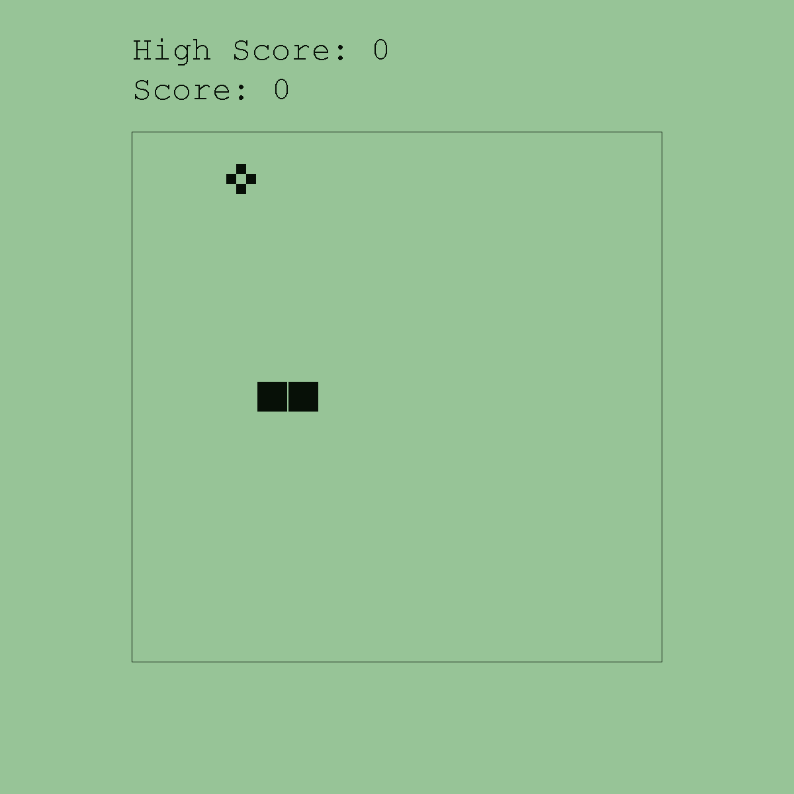

# Classic Snake Game on Java

[Snake](https://en.wikipedia.org/wiki/Snake_(video_game_genre)) is a game that originated in a 1976 arcade game called [Blockade](https://en.wikipedia.org/wiki/Blockade_(video_game)). A variant of this game was popularised when it came preloaded on Nokia phones in 1998.

The program is a recreation of this game. It can be played using the arrow keys.

  

